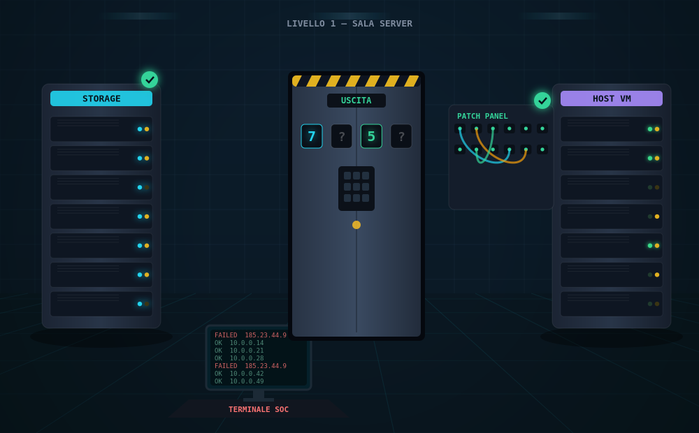
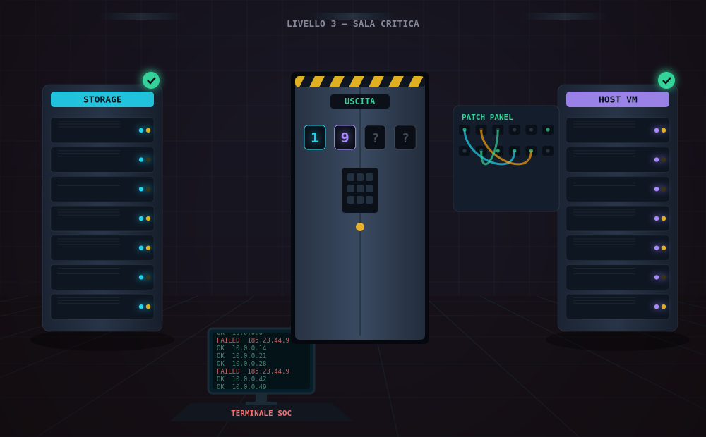

# 🖥️ Datacenter Lockdown — Escape Room IT (gioco grafico a livelli)

Una **escape room grafica punta-e-clicca**, giocabile nel browser, per la **formazione di tecnici IT**.
Sei chiuso in un datacenter in *lockdown*: **esplori la sala cliccando sugli apparati** e risolvi enigmi
**manipolando gli oggetti** (trascini dischi e VM, colleghi cavi, classifichi dati, scrivi regole firewall,
dimensioni subnet, individui intrusi nei log) per trovare il codice e aprire la **porta blindata**.

Ora è una **campagna a 3 livelli** con **difficoltà crescente** e **3 modalità** di gioco.

> Niente domande a risposta multipla: **si gioca facendo**.
> HTML5 Canvas + JavaScript, **nessuna dipendenza, nessuna installazione**. Funziona anche offline, su mouse e touch.

| Livello 1 — Sala Server | Livello 3 — Sala Critica |
|---|---|
|  |  |

---

## ▶️ Come si gioca

**Apri `index.html`** (doppio clic) — oppure, in aula:
```bash
python3 -m http.server 8000      # poi http://localhost:8000
```

1. Scegli una **modalità** di difficoltà.
2. In ogni livello, **clicca i 4 apparati** luminescenti e risolvi i loro enigmi: ognuno dà una **cifra**.
3. Clicca la **porta blindata**, digita il **codice a 4 cifre** sul tastierino e passa al livello successivo.
4. Supera tutti e **3 i livelli** per completare la campagna.

I progressi si salvano da soli nel browser (puoi chiudere e riprendere).

---

## 🎚️ Modalità di difficoltà

| Modalità | Per chi | Indizi/livello |
|---|---|---|
| **Junior** | onboarding, ritmo tranquillo | 4 |
| **Intermedio** | esperienza operativa | 2 |
| **Senior** | sotto pressione | 1 |

La difficoltà cresce anche **da un livello all'altro** (parametri più tosti, enigmi nuovi).

## 🗺️ I 3 livelli e gli enigmi

Le 4 stazioni della sala (Storage 🟦, Virtualizzazione 🟪, Network 🟩, Security 🟥) cambiano enigma a ogni livello:

| Categoria | Livello 1 — Sala Server | Livello 2 — Sala Rete | Livello 3 — Sala Critica |
|---|---|---|---|
| **Storage** | Costruisci un **array RAID** (RAID 0/1/5) trascinando i dischi | **Tiering**: classifica i dati su SSD / HDD / Tape | **RAID ad alta resilienza** (RAID 6, tollera 2 guasti) |
| **Virtualizzazione** | **Assegna le VM** al host senza overcommit | Consolida con **più VM e distrattori** | **Cluster a 2 host**: bilancia il carico |
| **Network** | **Ripristina il cablaggio** PC→Switch→Router→Internet | **Subnetting**: scegli il prefisso giusto (/26 ecc.) | **Topologia con DMZ** e firewall |
| **Security** | **Trova l'IP** brute-force nel log | **Regole firewall**: ALLOW/DENY corretti | Log più lungo, **attaccante più nascosto** |

**8 meccaniche di enigma** diverse, riusate e scalate sui 3 livelli → ~12 enigmi per partita.
Ogni enigma ha un **indizio** (💡, a budget per modalità) e un **feedback live** (barra RAM in overcommit,
pacchetto che viaggia sui cavi, host bilanciati, ecc.). Nessun *game over*.

---

## ✨ Caratteristiche

- **Sala disegnata e animata** su `<canvas>`: rack con LED, porta blindata, patch panel, monitor, prospettiva, tinta per livello.
- **Hover + click** sugli apparati; **drag & drop** con **mouse e touch** (pointer events).
- **HUD**: livello, modalità, indizi rimasti, slot del codice, cronometro, audio on/off, reset.
- **Effetti sonori** sintetici (Web Audio, disattivabili). **Salvataggio** in `localStorage`. **Responsive**.

## 🗂️ Struttura

```
EscapeRoom/
├── index.html              # il gioco
├── assets/
│   ├── logic.js            # REGOLE pure (RAID, tiering, VM, subnet, firewall, log) — testabili
│   ├── scene.js            # sala su canvas: disegno, animazione, click sugli oggetti, tinta per livello
│   ├── puzzles.js          # 8 varianti di enigma interattive (dispatcher G.buildPuzzle)
│   ├── main.js             # campagna: modalità, livelli, HUD, tastierino, transizioni, salvataggio
│   ├── audio.js            # effetti sonori sintetici
│   └── style.css           # interfaccia
├── docs/                   # anteprime
├── test/logic.test.js      # test delle regole (nessuna dipendenza)
├── quiz/                   # versione precedente "a domande" (giocabile da quiz/index.html)
└── package.json
```

## ✅ Test

```bash
npm test     # regole degli enigmi (37 controlli) + validazione contenuti del quiz — zero dipendenze
```

Le **regole tecniche** (capacità RAID/RAID6, overcommit su 1 e 2 host, host utilizzabili di una subnet,
rilevamento brute-force, correttezza delle regole firewall, tiering) sono in `assets/logic.js` e coperte da
`test/logic.test.js`. Il flusso completo della campagna (scelta modalità → 3 livelli → ogni variante di enigma
→ tastierino → vittoria) è stato verificato end-to-end con jsdom durante lo sviluppo.

## 🔧 Personalizzazione

- **Livelli, modalità, codici, stazioni** → `assets/main.js` (`G.LEVELS`, `G.MODES`).
- **Regole/obiettivi** degli enigmi → `assets/logic.js`.
- **Parametri** di ogni variante (dischi, VM, nodi, subnet, log, regole) → passati da `G.LEVELS` ai builder in `assets/puzzles.js`.
- **Aspetto** della sala → `assets/scene.js` (`LAYOUT`).

## 📋 Versione "a domande" (quiz)

La prima versione — escape room a **quiz** con spiegazioni didattiche — è conservata in **`quiz/`** e
resta giocabile aprendo `quiz/index.html`.

## 📄 Licenza

[MIT](LICENSE) — libero uso, anche a scopo formativo aziendale.
